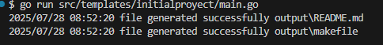

# golang-template-example

[](https://github.com/FrancoPersonal/golang-template-example/releases)
[](https://github.com/FrancoPersonal/golang-template-exampl)
[](cover.html)

# Directory
``` 
📦golang-template-example
 ┣ 📂output
 ┣ 📂src
 ┃ ┣ 📂filegenerator
 ┃ ┃ ┗ 📜generator.goadd
 ┃ ┗ 📂templates
 ┃ ┃ ┗ 📂initialproyect
 ┃ ┃ ┃ ┣ 📂files
 ┃ ┃ ┃ ┃ ┣ 📜makefile
 ┃ ┃ ┃ ┃ ┗ 📜README.md
 ┃ ┃ ┃ ┣ 📜main.go
 ┃ ┃ ┃ ┣ 📜prompt.txt
 ┃ ┃ ┃ ┗ 📜templatejson.json
 ┣ 📦templateBase
 ┃ ┣ 📂files
 ┣ ┣ 📜main.go
 ┣ ┣ 📜prompt.txt
 ┣ ┗ 📜templatejson.json
 ┣ 📜go.mod
 ┣ 📜makefile
 ┗ 📜README.md
```
# Templates

## initialproyect:
**Description :** create a basic solution for golang
**Usage :** 
``` batch
go run src/templates/initialproyect/main.go
```


the output path you can find the files generated


# Create a new template
``` batch
go run src/templates/templatebase/main.go TEMPLATENAME
```

## 
``` 
📦{{.TemplateName}}
 ┣ 📂files   # Template files folder
 ┣ 📜main.go # principal aplication
 ┗ 📜templatejson.json # variables
 ```

# MakeFile commands

- **clean :** clean files created
- **init :** initialize repository
- **test :** run unit test
- **coverage :** run unit test and make the HTML with the coverage
- **coverage :** run unit test and make the HTML with the coverage
- **showcoverage :** run unit test and show the HTML with the coverage
- **newtemplate :** example command to create a new template

example:
``` batch
makefile init
```